# SeeSomethingSaySomething

## Opis projektu

SeeSomethingSaySomething to aplikacja webowa typu SPA (Single Page Application) zbudowana w React. Projekt został zrealizowany jako ćwiczenie laboratoryjne, którego celem było stworzenie funkcjonalnej aplikacji frontendowej opartej na dostarczonym prototypie interfejsu. Aplikacja umożliwia użytkownikowi przeglądanie treści, zgłaszanie obserwacji oraz korzystanie z panelu administracyjnego dostępnego po zalogowaniu.

Projekt jest w pełni wdrożony na GitHub Pages i obsługuje analitykę ruchu przez Google Analytics oraz Contentsquare (platforma z ekosystemu Hotjar), co pozwala monitorować zachowania użytkowników w czasie rzeczywistym.

#### Strona główna aplikacji

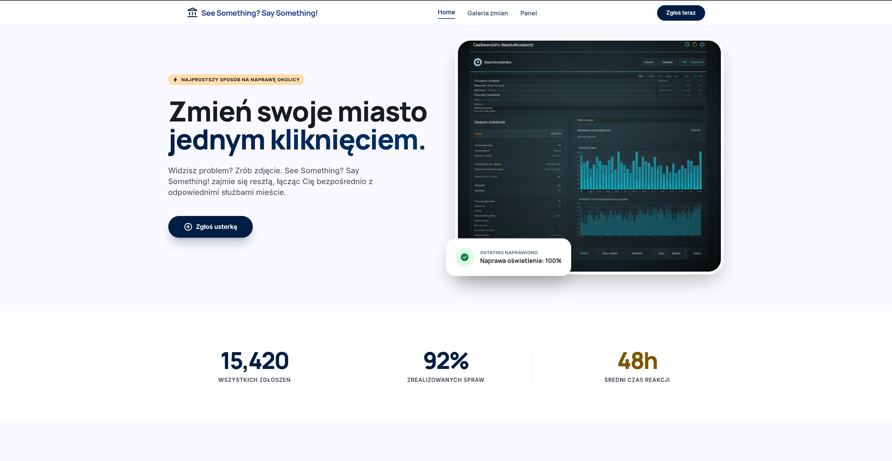

## Technologie i narzędzia

Aplikacja została zbudowana przy użyciu następującego stosu technologicznego:

- **React 18** — biblioteka do budowy interfejsu użytkownika
- **Vite** — szybkie środowisko deweloperskie i narzędzie do budowania
- **React Router DOM** — routing po stronie klienta
- **Tailwind CSS** — stylowanie przez klasy narzędziowe
- **Firebase Authentication** — logowanie użytkowników email/hasło
- **react-ga4** — integracja Google Analytics 4
- **Contentsquare / Hotjar** — analityka zachowań użytkowników
- **gh-pages** — automatyczny deploy na GitHub Pages

## Struktura projektu

Projekt został podzielony na warstwy według odpowiedzialności:
```
src/
  pages/              # pełne widoki ekranów
    HomePage.jsx
    SendRequestPage.jsx
    GaleryPage.jsx
    LoginPage.jsx
    NotFoundPage.jsx
    dashboard/
      DashboardLayout.jsx
      OverviewPage.jsx
      SettingsPage.jsx
  components/
    layout/           # Navbar, Footer
    ui/               # Button, Input, Card
  context/
    AuthContext.jsx   # stan autoryzacji
  analytics.js        # konfiguracja GA4
  App.jsx             # routing i layout
  main.jsx            # punkt wejścia
```

## 1. Odwzorowanie prototypu

Interfejs aplikacji odwzorowuje prototyp dostarczony w ramach projektu. Zachowano układ sekcji, kolejność elementów, typy komponentów (formularze, karty, menu, przyciski) oraz podstawową responsywność. Każdy ekran jest rozpoznawalny i zgodny z pierwotnym projektem wizualnym.

Na stronie głównej widoczna jest sekcja hero, informacje o projekcie i wezwanie do działania. Strona galerii prezentuje zbiór zgłoszonych obserwacji. Formularz zgłoszeń pozwala użytkownikowi wpisać i wysłać dane. Panel administracyjny jest dostępny wyłącznie po zalogowaniu.

#### Galeria zgłoszonych obserwacji

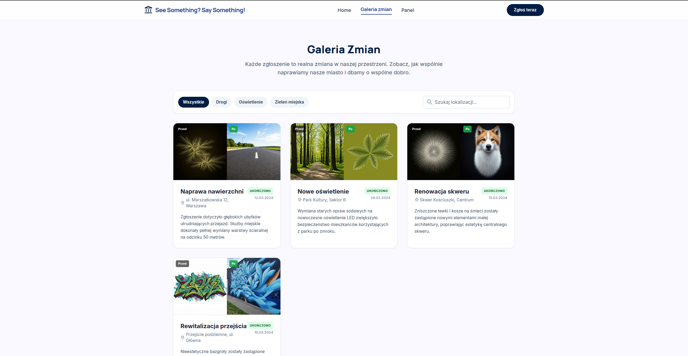

#### Formularz zgłaszania obserwacji

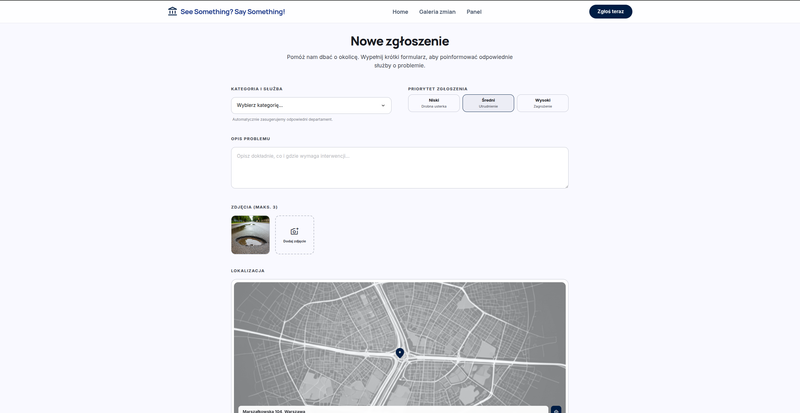

#### Panel administracyjny

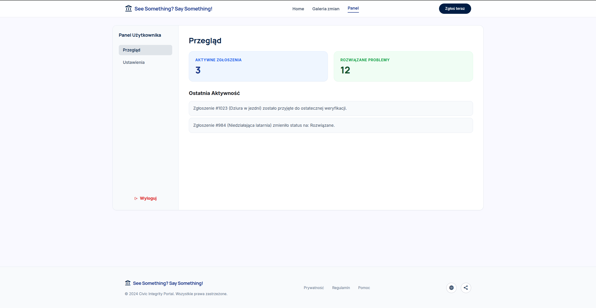

## 2. Routing wszystkich ekranów

Każdy ekran aplikacji ma przypisaną osobną trasę w React Router. Nawigacja odbywa się bez przeladowania strony, co jest cechą charakterystyczną SPA. Dla nieistniejących adresów URL zaimplementowano dedykowany widok 404. Dashboard korzysta z routingu zagnieżdżonego, dzięki czemu podstrony panelu sa dostępne przez `/dashboard/settings`.

Pełna lista tras:

| Ścieżka | Komponent |
|---|---|
| `/` | HomePage |
| `/send-request` | SendRequestPage |
| `/galery` | GaleryPage |
| `/login` | LoginPage |
| `/dashboard` | OverviewPage (w DashboardLayout) |
| `/dashboard/settings` | SettingsPage (w DashboardLayout) |
| `*` | NotFoundPage |

#### Strona błędu 404 — nieistniejący adres URL

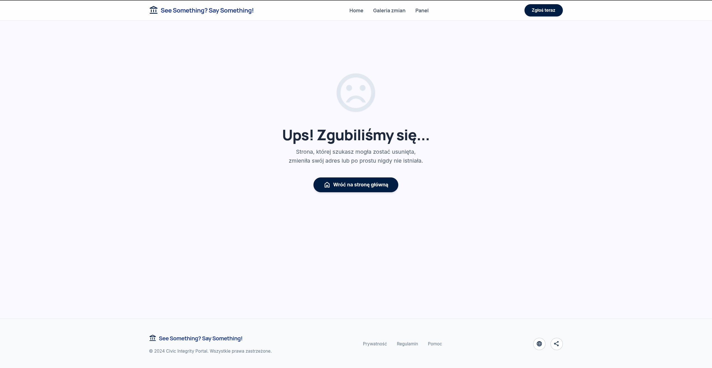

## 3. Podzial na strony w folderze pages

Każdy główny widok aplikacji jest osobnym komponentem strony umieszczonym w folderze `src/pages`. Dzięki temu każda strona ma wyraźnie określoną odpowiedzialność, jest podpięta pod swoja trasę i można ja rozwijać niezależnie od pozostałych. Folder `dashboard/` zawiera dodatkowo oddzielny layout panelu z własną nawigacją boczną.

#### Struktura folderu pages w edytorze kodu

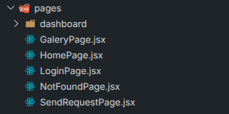

## 4. Komponenty reuzywalne

Powtarzające się elementy interfejsu zostały wydzielone do komponentów wielokrotnego użytku. Znajdują się w folderze `src/components` i są używane w wielu miejscach aplikacji:

- **Button** — przycisk z wariantami (primary, outline, danger), rozmiarami i propem `disabled`
- **Input** — pole formularza z etykietą i obsługą błędu przez prop `error`
- **Card** — karta z możliwością przekazania dowolnej zawartosci przez `children`
- **Navbar** — gorny pasek nawigacji z linkami i przyciskiem CTA
- **Footer** — stopka wyswietlana na kazdej stronie

Dzięki tej strukturze interfejs jest spójny, a kod nie zawiera duplikacji.

#### Komponenty UI użyte w aplikacji (Button, Input, Card)

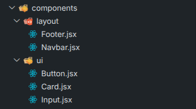

## 5. Stylowanie i wyglad

Aplikacja jest ostylowana z uzyciem Tailwind CSS. Zadbano o spójną kolorystykę opartej na niebieskiej palecie, czytelną typografię (czcionki Manrope i Inter), odpowiednie odstępy, zaokrąglone narożniki i cieniowanie kart. Elementy interaktywne posiadają stany hover i focus. Interfejs jest estetyczny i czytelny zarówno na urządzeniach mobilnych, jak i desktopowych.

#### Wyglad aplikacji — paleta kolorow, typografia, odstępy


## 6. Logowanie i autoryzacja (Firebase Authentication)

System logowania został zrealizowany z uzyciem Firebase Authentication (metodą Email/Password). Uzytkownik wprowadza adres e-mail i hasło w formularzu logowania, a po poprawnej weryfikacji uzyskuje dostęp do panelu administracyjnego. Wylogowanie kończy sesję i przekierowuje do strefy publicznej.

Ochrona tras została zrealizowana przez komponent `ProtectedRoute`, który sprawdza stan autoryzacji z Firebase przed wyrenderowaniem chronionego widoku. Trasa `/login` jest z kolei chroniona przez `GuestRoute` — po zalogowaniu użytkownik jest automatycznie przekierowywany do dashboardu.

Konfiguracja Firebase jest przechowywana w zmiennych środowiskowych `.env`, a inicjalizacja odbywa się w `src/firebase.js`.

#### Formularz logowania (email + hasło)

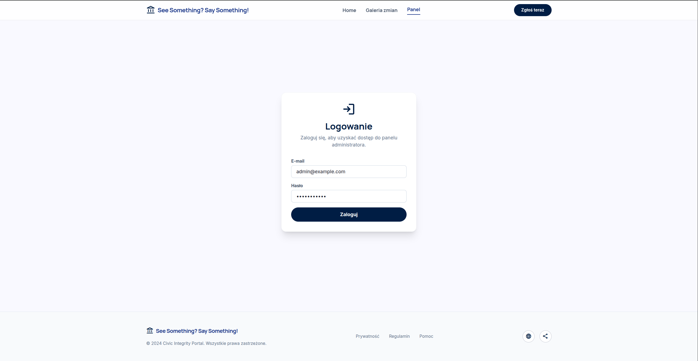

#### Panel administracyjny po poprawnym zalogowaniu


#### Strona ustawien w panelu użytkownika

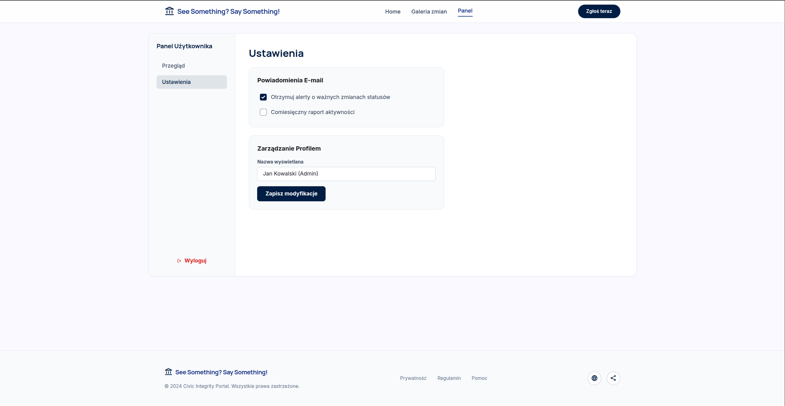

## 7. Integracja Hotjar / Contentsquare

Do projektu został dodany skrypt analityczny Contentsquare (platforma z ekosystemu Hotjar), osadzony globalnie w sekcji `<head>` pliku `index.html`. Narzedzie automatycznie rejestruje sesję, interakcje użytkowników (kliknięcia, scroll, nawigację) i pozwala oglądać nagrania sesji oraz mapy ciepla w panelu Contentsquare.

Integracja została zweryfikowana — requesty eventowe trafiają poprawnie na serwery `c.ba.contentsquare.net/v2/events`.

#### Potwierdzenie poprawnej instalacji tagu Contentsquare

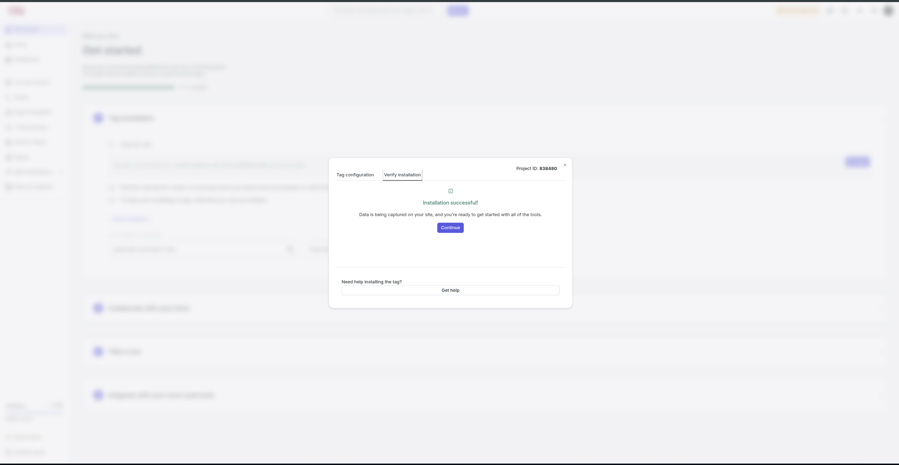

#### Dashboard Contentsquare — przegląd sesji i aktywnosci

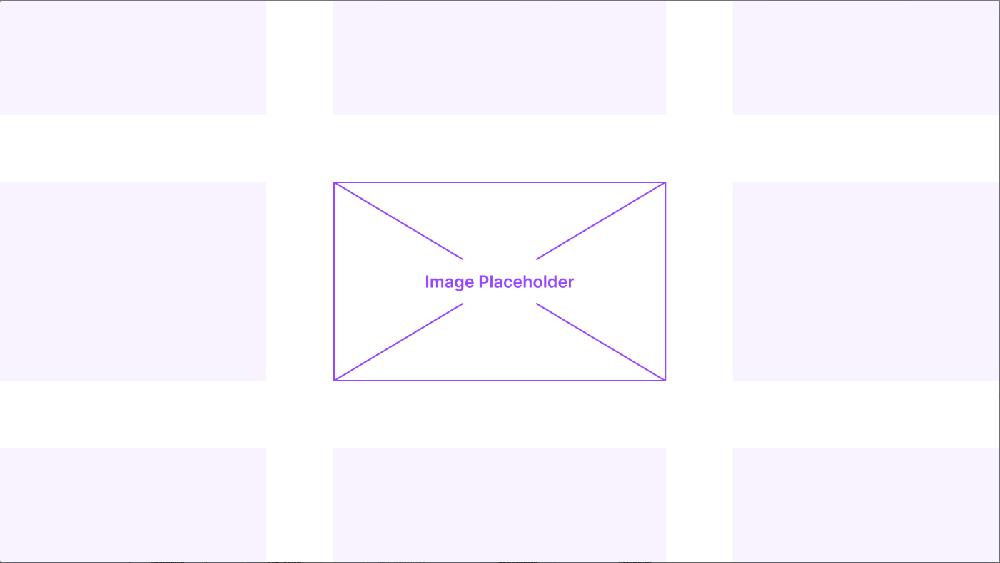

#### Session Replay — nagranie sesji użytkownika


## 8. Integracja Google Analytics

Google Analytics 4 został wdrożony przez bibliotekę `react-ga4`. Inicjalizacja następuje przy starcie aplikacji w `src/main.jsx`, a zdarzenia `page_view` sa wysyłane automatycznie przy kazdej zmianie trasy w `src/App.jsx`. Dzięki temu kazde przejście między podstronami jest rejestrowane, co daje wiarygodny obraz aktywnosci użytkowników w aplikacji SPA.

#### Google Analytics — widok Realtime z aktywna sesja


## 9. Deploy aplikacji

Aplikacja jest wdrożona publicznie na GitHub Pages. Proces publikacji przebiega następująco:

1. Zmiany sa commitowane i wypychane na branch `main`.
2. Komenda `npm run deploy` buduje wersje produkcyjną i wysyła folder `dist` na branch `gh-pages`.
3. GitHub Pages serwuje aplikacje bezpośrednio z brancha `gh-pages`.

```bash
npm run deploy
```

Aplikacja jest dostępna pod adresem:
`https://potatozip.github.io/SeeSomethingSaySomething/`

#### Opublikowana aplikacja działająca na GitHub Pages

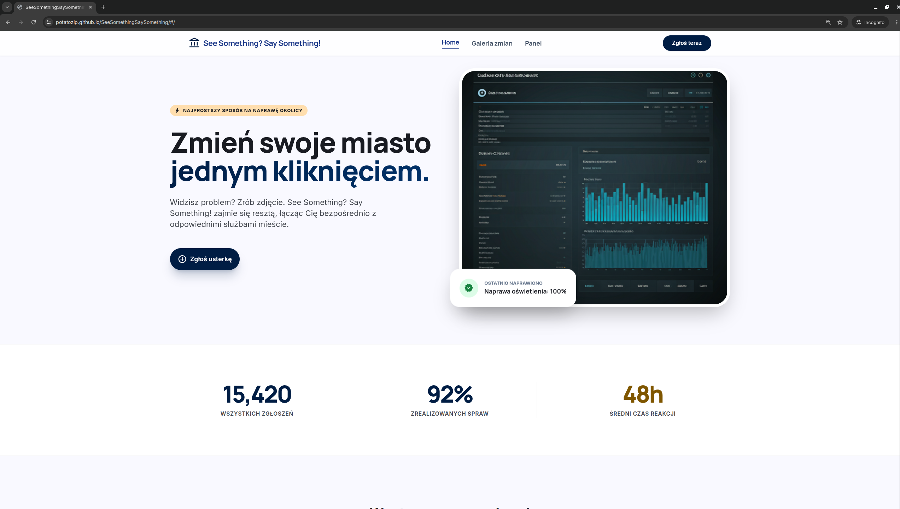

## Uruchomienie lokalne

Aby uruchomić projekt lokalnie:

```bash
npm install
npm run dev
```

Build produkcyjny:

```bash
npm run build
```

## Podsumowanie

Projekt obejmuje kompletną implementację aplikacji SPA — od struktury komponentów i routingu, przez autoryzację użytkowników z Firebase, aż po integrację analityki i wdrożenie produkcyjne na GitHub Pages.

Architektura opiera się na czytelnym podziale odpowiedzialności: osobne strony, reużywalne komponenty UI i centralny kontekst autoryzacji. Analityka działa dwutorowo — Google Analytics rejestruje ruch między podstronami, a Contentsquare umożliwia obserwację sesji i interakcji użytkowników w czasie rzeczywistym.
